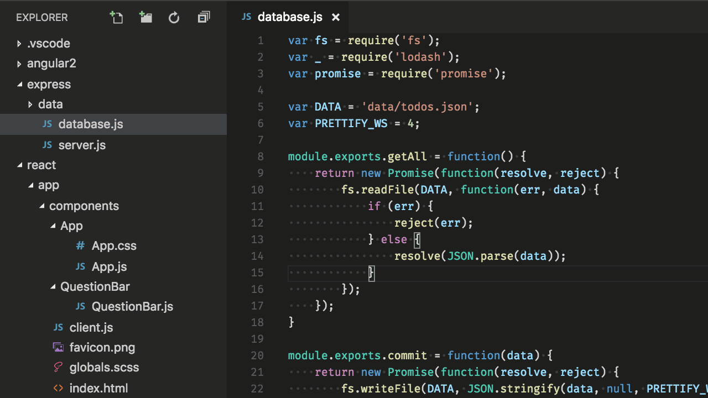

# Visual Studio Code 技巧和窍门

## basics

1. Getting started

动手探索 VS Code 的最佳方式是打开“入门”页面。您将大致了解 VS Code 的自定义和功能。帮助 > 开始。

编辑广场：Help > Editor Playground.

2. 命令面板

- `⌘K⌘T` 打开主题设置
- `⇧⌘P` 打开命令面板

3. Keyboard reference sheets

## Quick Open

1. 打开文件快捷键: `⌘P`

>提示：输入 ?查看命令建议
> 键入诸如 edt 和 term 之类的命令后跟一个空格将显示下拉列表。


1. 重复快速打开键盘快捷键以在最近打开的文件之间快速循环。

2. 您可以通过按向右箭头键从“快速打开”中打开多个文件。这将在后台打开当前选择的文件，您可以继续从“快速打开”中选择文件。

3. 在最近打开的文件夹和工作区之间导航 `⌃R` 或 `File > Open Recent`

[键盘快捷键参考表](chrome-extension://ikhdkkncnoglghljlkmcimlnlhkeamad/pdf-viewer/web/viewer.html?file=https%3A%2F%2Fcode.visualstudio.com%2Fshortcuts%2Fkeyboard-shortcuts-macos.pdf)

## 命令行（ Command line）

```shell
# open code with current directory
code .

# open the current directory in the most recently used code window
code -r .

# create a new window
code -n

# change the language
code --locale=es

# open diff editor
code --diff <file1> <file2>

# open file at specific line and column <file:line[:character]>
code --goto package.json:10:5

# see help options
code --help

# disable all extensions
code --disable-extensions .
```

## 状态栏

1. 错误和警告
键盘快捷键：`⇧⌘M`

- 快速跳转到项目中的错误和警告:使用`F8`或`⇧F8`循环查看错误


2.改变语言模式

键盘快捷键：`⌘K M`

## 自定义

您可以做很多事情来自定义 VS Code：

1. 改变主题
快捷键：`⌘K ⌘T`


`Keymaps`:  
您是否习惯使用其他编辑器的键盘快捷键？你可以安装一个 Keymap 扩展，将键盘快捷键从你最喜欢的编辑器带到 VS Code。转到 `Preferences > Keymaps` 以查看 Marketplace 上的一些比较流行的

2. 更改键盘快捷键
键盘快捷键：`⌘K ⌘S`


3. 调整您的设置

> 打开用户设置 settings.json
键盘快捷键：`⌘，`

4. 添加 JSON 验证
5. 创建片段
6. 安装扩展

键盘快捷键：`⇧⌘X`
在扩展视图中，您可以通过搜索栏搜索或单击更多操作 (...) 按钮以按安装计数进行过滤和排序。


在扩展视图中，单击更多操作 (...) 按钮菜单中的显示推荐扩展。


## 文件和文件夹

1. 集成终端  
快捷键：: ⌃\`
2. 切换侧边栏  
快捷键：`⌘B`
3. 切换面板  
快捷键：`⌘J`
4. zen模式
快捷键：`⌘k Z`
5. 并排编辑
快捷键：`⌘\`
6. 在编辑器之间切换
快捷键：`⌘1`,`⌘2`, `⌘3`
7. 移动到资源管理器窗口
快捷键：`⇧⌘E`
8. 创建或打开文件
快捷键：`Cmd+click`


9. 关闭当前打开的文件夹
快捷键：`⌘W`
10. 导航历史
快捷键：`⌃Tab`
Navigate back: `⌃-`

Navigate forward: `⌃⇧-`

## 编辑技巧

1. 多光标选择
键盘快捷键：`⌥⌘↑`或`⌥⌘↓`


您可以使用 `⇧⌘L` 将其他光标添加到当前选择的所有匹配项


如果您不想添加当前选择的所有匹配项，可以使用 ⌘D 代替。这只会选择您选择的那个之后的下一个匹配项，因此您可以一个接一个地添加选择。


1. 列（框）选择
您可以在拖动鼠标的同时按住 `Shift+Option`来选择文本块。每个选定行的末尾将添加一个单独的光标。


2. 快速滚动
按 `⌥` 键可以在编辑器和资源管理器中快速滚动。默认情况下，快速滚动使用 5X 速度倍增器，但您可以使用 Editor: Fast Scroll Sensitivity (editor.fastScrollSensitivity) 设置控制倍增器。

3. 向上/向下复制行
快捷键：`⇧⌥↑` or `⇧⌥↓`


1. 上下移动行
键盘快捷键：`⌥↑`或`⌥↓`


5. Shrink / expand selection
键盘快捷键：`⌃⇧⌘←`或`⌃⇧⌘→`


6. 转到文件中的符号


您可以通过添加冒号 @: 按种类对符号进行分组。


7. 转到工作区中的符号
键盘快捷键：`⌘T`


8. 导航到特定行
键盘快捷键：`⌘G`
9. 撤消光标位置
键盘快捷键：`⌘U`
10. 消除末尾空行
键盘快捷键：`⌘K ⌘X`


11. 转换文本命令
您可以使用命令面板中的转换命令将选定的文本更改为大写、小写和首字母大写。


12. 代码格式化
当前选择的源代码：`⌘K ⌘F`
整个文档格式：`⇧⌥F`


13. 代码折叠
键盘快捷键：`⌥⌘[`和`⌥⌘]`


您还可以使用全部折叠 (⌘K ⌘0) 和全部展开 (⌘K ⌘J) 在编辑器中折叠/展开所有区域。
您可以使用折叠所有块注释 (⌘K ⌘/) 折叠所有块注释。
14. 选择当前行
键盘快捷键：`⌘L`
15. 导航到文件的开头和结尾
键盘快捷键：`⌘↑` 和 `⌘↓`
16. 打开 Markdown 预览
在 Markdown 文件中，使用
键盘快捷键：`⇧⌘V` `⌘K V`
