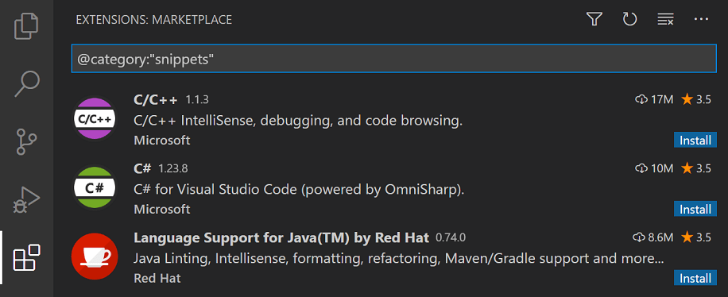

# 代码片段

代码片段是可以更轻松地输入重复代码模式的模板，例如循环或条件语句。

在 Visual Studio Code 中，片段显示在 IntelliSense (⌃Space) 中与其他建议混合在一起，以及在专用的片段选择器中（在命令面板中插入片段）。还支持制表符补全：使用“editor.tabCompletion”启用它：“on”，键入片段前缀（触发文本），然后按 Tab 键插入片段。

## 内置片段

VS Code 具有多种语言的内置代码片段，例如：JavaScript、TypeScript、Markdown 和 PHP。


您可以通过在命令面板中运行 Insert Snippet 命令来查看一种语言的可用片段，以获取当前文件语言的片段列表。但是，请记住，此列表还包括您已定义的用户片段，以及您已安装的扩展程序提供的任何片段。

## 从市场安装代码片段

VS Code Marketplace 上的许多扩展都包含代码片段。您可以使用 @category:"snippets" 过滤器在扩展视图 (⇧⌘X) 中搜索包含片段的扩展。



## 创建自己的片段

您可以轻松定义自己的片段，无需任何扩展。要创建或编辑您自己的代码片段，请在文件 > 首选项（macOS 上的代码 > 首选项）下选择用户代码片段，然后选择代码片段应显示的语言（按语言标识符），或者如果它们应该选择新全局代码片段文件选项出现在所有语言中。 VS Code 为您管理底层代码片段文件的创建和刷新。

片段文件是用 JSON 编写的，支持 C 风格的注释，并且可以定义无限数量的片段。 Snippets 支持大多数 TextMate 动态行为语法，根据插入上下文智能地格式化空白，并允许轻松的多行编辑。
下面是 JavaScript 的 for 循环片段示例：

```json
// in file 'Code/User/snippets/javascript.json'
{
  "For Loop": {
    "prefix": ["for", "for-const"],
    "body": ["for (const ${2:element} of ${1:array}) {", "\t$0", "}"],
    "description": "A for loop."
  }
}
```

- `For Loop`是片段名称。如果未提供说明，则通过 IntelliSense 显示。
- `prefix`定义在 IntelliSense 中显示片段的一个或多个触发词。子字符串匹配是在前缀上执行的，所以在这种情况下，“fc”可以匹配“for-const”。
- `body` 是一行或多行内容，在插入时将合并为多行。换行符和嵌入的选项卡将根据插入片段的上下文进行格式化。
- `description` 是 IntelliSense 显示的片段的可选描述
  
此外，上面示例的主体包含三个占位符（按遍历顺序列出）：${1:array}、${2:element} 和 $0。您可以使用 Tab 快速跳转到下一个占位符，此时您可以编辑占位符或再次跳转下一个占位符。冒号后面的字符串（如果有）是默认文本，例如 ${2:element} 中的元素。占位符遍历顺序是按数字升序，从一开始；零是一个可选的特殊情况，总是最后出现，并在光标位于指定位置时退出片段模式。

### Snippet scope

片段是有范围的，因此只建议相关的片段。片段可以通过以下任一方式确定范围：

- 片段范围的语言

- 片段范围的项目

1. 语言片段范围

2. 项目片段范围

您还可以将全局片段文件（文件后缀为 .code-snippets 的 JSON）限定为您的项目。项目文件夹片段是使用 Preferences: Configure User Snippets 下拉菜单中的 New Snippets file for ''... 选项创建的，位于项目根目录下的 .vscode 文件夹中。项目片段文件对于与在该项目中工作的所有用户共享片段很有用。项目文件夹片段类似于全局片段，可以通过范围属性将范围限定为特定语言

## Snippet 语法

1. Tabstops

使用制表位，您可以使编辑器光标在片段内移动。使用 $1, $2 指定光标位置。数字是访问制表位的顺序，而 $0 表示最终光标位置。同一制表位的多次出现被链接并同步更新。
占位符

1. Placeholders

占位符是带有值的制表位，例如 ${1:foo}。占位符文本将被插入和选择，以便可以轻松更改。占位符可以嵌套，例如 ${1:another ${2:placeholder}}。

1. 选择

占位符可以有选择作为值。语法是逗号分隔的值枚举，用竖线字符括起来，例如 ${1|one,two,three|}。当插入片段并选择占位符时，选项将提示用户选择其中一个值。

1. 占位符

使用 $name 或 ${name:default}，您可以插入变量的值。如果未设置变量，则插入其默认值或空字符串。当变量未知（即未定义其名称）时，将插入变量的名称并将其转换为占位符。

可使用的变量：
- `TM_SELECTED_TEXT` 当前选中的文本或空字符串
- `TM_CURRENT_LINE` 当前行的内容
- `TM_CURRENT_WORD` 光标下单词的内容或空字符串
- `TM_LINE_INDEX` 基于零索引的行号
- `TM_LINE_NUMBER` 基于单索引的行号
- `TM_FILENAME` 当前文档的文件名
- `TM_FILENAME_BASE` 当前文档的文件名，不带扩展名
- `TM_DIRECTORY` 当前文档的目录
- `TM_FILEPATH` 当前文档的完整文件路径
- `RELATIVE_FILEPATH` 当前文档的相对（相对于打开的工作区或文件夹）文件路径
- `CLIPBOARD` 剪贴板的内容
- `WORKSPACE_NAME` 打开的工作空间或文件夹的名称
- `WORKSPACE_FOLDER` 打开的工作空间或文件夹的路径
当前时间和日期变量：
- `CURRENT_YEAR` The current year
- `CURRENT_YEAR_SHORT` The current year's last two digits
- `CURRENT_MONTH` The month as two digits (example '02')
- `CURRENT_MONTH_NAME` The full name of the month (example 'July')
- `CURRENT_MONTH_NAME_SHORT` The short name of the month (example 'Jul')
- `CURRENT_DATE` The day of the month as two digits (example '08')
- `CURRENT_DAY_NAME` The name of day (example 'Monday')
- `CURRENT_DAY_NAME_SHORT` The short name of the day (example 'Mon')
- `CURRENT_HOUR` The current hour in 24-hour clock format
- `CURRENT_MINUTE` The current minute as two digits
- `CURRENT_SECOND` The current second as two digits
- `CURRENT_SECONDS_UNIX` The number of seconds since the Unix epoch

## 将键绑定分配给片段

您可以创建自定义键绑定以插入特定的片段。打开 keybindings.json (Preferences: Open Keyboard Shortcuts File)，它定义了所有的键绑定，并添加一个传递“snippet”作为额外参数的键绑定：

```json
{
  "key": "cmd+k 1",
  "command": "editor.action.insertSnippet",
  "when": "editorTextFocus",
  "args": {
    "snippet": "console.log($1)$0"
  }
}
```
