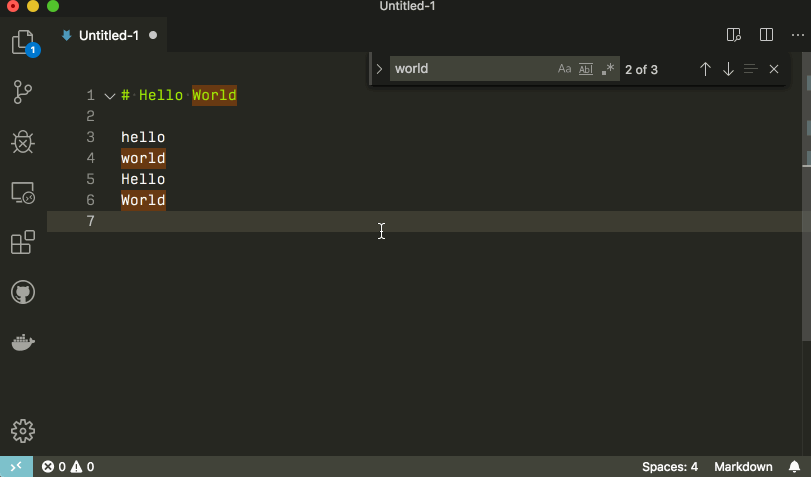

# 基本编辑功能

Visual Studio Code 首先是一个编辑器，它包含高效编辑源代码所需的功能。

## 快捷键

编写代码时能够将手放在键盘上对于提高生产力至关重要。 VS Code 有一组丰富的默认键盘快捷键，并且允许您自定义它们。

## 多光标

添加更多光标的常用方法是使用 `⌥⌘↓` 或 `⌥⌘↑` 在下方或上方插入光标

`⌘D` 选择光标处的单词，或当前选择的下一个匹配项。

>您还可以使用 `⇧⌘L` 添加更多光标，将选择所要已选择的文本。

快速缩小或扩大当前选择。使用 `⌃⇧⌘←` 和 `⌃⇧⌘→` 触发它。


## 列选择

`options + Shift` + 拖拽鼠标

在 macOS 和 Windows 上也有用于列选择的默认键绑定。
| Key | Command |
| - | - |
|`⇧↓`  | 向下选择列|
|`⇧↑` |向上选择列|
|`⇧←` |左列选择|
|`⇧→` |右列选择|

## 查找和替换

`⌘F` 在当前文件查找

按 `Enter` 和 `⇧Enter` 导航到下一个或上一个结果

您可以通过将文本粘贴到查找输入框和替换输入框来搜索多行文本。按 Ctrl+Enter 在输入框中插入新行。

搜索长文本时，可以拖动左侧窗扇以放大查找小部件或双击左侧窗扇以最大化或将其缩小到默认大小


## 跨文件搜索

VS Code 允许您快速搜索当前打开的文件夹中的所有文件。按 ⇧⌘F 并输入您的搜索词。

您可以通过单击右侧搜索框下方的省略号（切换搜索详细信息）来配置高级搜索选项（或按⇧⌘J）。这将显示配置搜索的附加字段。

在搜索框下方的两个输入框中，您可以输入要在搜索中包含或排除的模式。如果您输入 example，它将匹配工作区中名为 example 的每个文件夹和文件。如果输入 ./example，它将与工作区顶层的文件夹 example/ 匹配。使用 , 分隔多个模式。路径必须使用正斜杠。您还可以使用 glob 语法：

跨文件搜索和替换

使用正则


## Search Editor


## 智能提示 IntelliSense

## 格式化

- 格式化文档 (`⇧⌥F`) - 格式化整个活动文件。
- 格式选择 (`⌘K ⌘F`) - 格式化所选文本。

## 折叠

您可以使用行号和行开头之间间距上的折叠图标来折叠源代码区域。将鼠标移到装订线上方并单击以折叠和展开区域。使用 Shift + 单击折叠图标可折叠或展开区域和内部的所有区域。

您还可以使用以下操作：

- 折叠 (⌥⌘[) 折叠光标处最里面的未折叠区域。
- 展开 (⌥⌘]) 展开光标处的折叠区域。
- Toggle Fold (⌘K ⌘L) 折叠或展开光标处的区域。
- 递归折叠 (⌘K ⌘[) 折叠光标处最里面的未折叠区域以及该区域内的所有区域。
- 递归展开 (⌘K ⌘]) 展开光标处的区域以及该区域内的所有区域。
- 全部折叠 (⌘K ⌘0) 折叠编辑器中的所有区域。
- 全部展开 (⌘K ⌘J) 在编辑器中展开所有区域。
- 折叠级别 X（⌘K ⌘2 表示级别 2）折叠级别 X 的所有区域，当前光标位置处的区域除外。
- 折叠所有块注释 (⌘K ⌘/) 折叠所有以块注释标记开头的区域。
## 缩进

```
 "editor.insertSpaces": true,
  "editor.tabSize": 4,
```

## 文件编码


