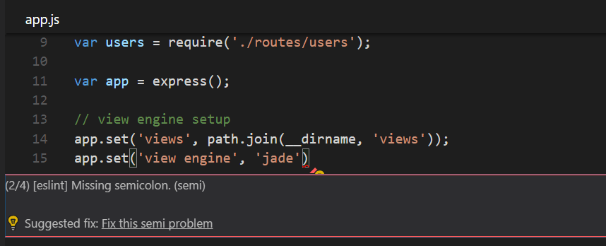

# 代码导航

Visual Studio Code 有一个高效率的代码编辑器，当它与编程语言服务结合使用时，可为您提供 IDE 的强大功能和文本编辑器的速度。在本主题中，我们将首先描述 VS Code 的语言智能功能（建议、参数提示、智能代码导航），然后展示核心文本编辑器的强大功能。

## 快速文件导航

>提示：当您键入 ⌘P（快速打开）时，您可以按文件名打开任何文件。

按住 Ctrl 并按 Tab 以查看在编辑器组中打开的所有文件的列表。要打开这些文件之一，请再次使用 Tab 选择要导航到的文件，然后释放 Ctrl 以打开它。

或者，您可以使用 ⌃- 和 ⌃⇧- 在文件之间导航和编辑位置。如果您在同一文件的不同行之间跳转，这些快捷方式可让您轻松地在这些位置之间导航。

## 面包屑

编辑器在其内容上方有一个导航栏，称为面包屑。它显示当前位置并允许您在文件夹、文件和符号之间快速导航。

面包屑始终显示文件路径，并在语言扩展的帮助下显示直到光标位置的符号路径。显示的符号与大纲视图和转到符号中的相同。

在路径中选择一个面包屑会显示一个包含该级别同级的下拉列表，以便您可以快速导航到其他文件夹和文件。

如果当前文件类型支持符号的语言，您将看到当前符号路径和同级及以下其他符号的下拉列表。

### 自定义面包屑

### 面包屑中的符号顺序

### 面包屑键盘导航

要与面包屑交互，请使用 Focus Breadcrumbs 命令或按 ⇧⌘.. 它将选择最后一个元素并打开一个下拉菜单，允许您导航到同级文件或符号。使用 ← 和 → 键盘快捷键转到当前元素之前或之后的元素。当下拉菜单出现时，开始输入 - 所有匹配的元素将被突出显示，并且将选择最佳匹配以进行快速导航。

您还可以在没有下拉菜单的情况下与面包屑交互。按⇧⌘；聚焦最后一个元素，使用 ← 和 → 导航，并使用 Space 在编辑器中显示元素。

## 转到定义

如果一种语言支持它，您可以按 F12 转到符号定义。
如果按下 Ctrl 并将鼠标悬停在符号上，将出现声明的预览：

>您可以使用 Ctrl+Click 跳转到定义或使用 Ctrl+Alt+Click 打开定义。

## 转到类型定义

某些语言还支持通过从编辑器上下文菜单或命令面板运行 Go to Type Definition 命令跳转到符号的类型定义。这将带您了解符号类型的定义。默认情况下，命令 editor.action.goToTypeDefinition 未绑定到键盘快捷键，但您可以添加自己的自定义键绑定。

## 转到实施

语言还可以支持通过按 ⌘F12 跳转到符号的实现。对于接口，这显示了该接口的所有实现者，对于抽象方法，这显示了该方法的所有具体实现。

## 转到符号

## 按名称打开符号

某些语言支持使用 ⌘T 跨文件跳转到符号。键入要导航到的类型的第一个字母，无论哪个文件包含它，然后按 Enter。

## peek

当您只想快速检查某些内容时，我们认为没有什么比大的上下文切换更糟糕的了。这就是为什么我们支持偷看的编辑器。当您执行 Go to References 搜索（通过 ⇧F12）或 Peek Definition（通过 ⌥F12）时，我们会内联嵌入结果：

## 支架匹配

一旦光标靠近其中一个，匹配的括号将被突出显示。

## 重命名符号

某些语言支持跨文件重命名符号。按 F2，然后键入所需的新名称并按 Enter。符号的所有用法都将跨文件重命名。

## 错误和警告

警告或错误可以通过配置的任务、丰富的语言服务或 linter 生成，它们会在后台不断分析您的代码。由于我们喜欢无错误的代码，因此警告和错误会出现在多个地方：

- 在状态栏中，有所有错误和警告计数的摘要。
- 您可以单击摘要或按 ⇧⌘M 以显示问题面板，其中包含所有当前错误的列表。
- 如果您打开包含错误或警告的文件，它们将与文本内联并在概览标尺中呈现。

>要遍历当前文件中的错误或警告，您可以按 F8 或 ⇧F8，这将显示一个内联区域，详细说明问题和可能的代码操作（如果可用）：

## Code Action

警告和错误可以提供代码操作（也称为快速修复）来帮助解决问题。这些将在编辑器的左边距中显示为一个灯泡。单击灯泡将显示代码操作选项或执行操作。

## 镶嵌提示

一些语言提供嵌入提示：
这是关于内联呈现的源代码的附加信息。这通常用于显示推断类型。下面的示例显示了显示 JavaScript 变量和函数返回类型的推断类型的嵌入提示。

## 外部链接

