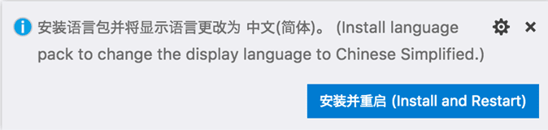
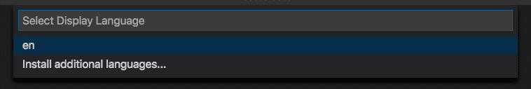

# 语言
默认情况下，Visual Studio Code 附带英语作为显示语言，其他语言依赖于市场提供的语言包扩展。
VS Code 会检测操作系统的 UI 语言，并会提示您安装相应的语言包（如果市场上有）。以下是推荐简体中文语言包的示例：

## 更改显示语言
按 ⇧⌘P 调出命令面板，然后开始输入“display”以过滤并显示配置显示语言命令。

按 Enter 键，将显示按区域设置的已安装语言列表，并突出显示当前区域设置。

## 市场语言包

