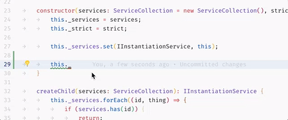

# 智能感知
`IntelliSense` 是各种代码编辑功能的总称，包括：代码完成、参数信息、快速信息和成员列表。 `IntelliSense` 功能有时被称为“代码完成”、“内容辅助”和“代码提示”等其他名称。

## 编程语言的 `IntelliSense`
Visual Studio Code `IntelliSense` 提供了开箱即用的 JavaScript、TypeScript、JSON、HTML、CSS、SCSS 和 Less。 VS Code 支持任何编程语言的基于单词的完成，但也可以通过安装语言扩展来配置为具有更丰富的 `IntelliSense`。

## 智能感知的功能
VS Code `IntelliSense` 功能由语言服务提供支持。语言服务基于语言语义和源代码分析提供智能代码完成。如果语言服务知道可能的补全，则 `IntelliSense` 建议将在您键入时弹出。
如果您继续键入字符，则成员（变量、方法等）列表将被过滤为仅包含包含您键入的字符的成员。
按 T​​ab 或 Enter 将插入选定的成员。

正如语言服务所提供的，您可以通过按 `⌃Space` 或单击信息图标来查看每种方法的快速信息。该方法的随附文档现在将展开到一边。扩展的文档将保持不变，并会在您浏览列表时更新。您可以通过再次按 `⌃Space` 或单击关闭图标来关闭它。

选择方法后，您将获得参数信息。

## 完成的类型 Types of completions
下面的 JavaScript 代码说明了 `IntelliSense` 完成。 `IntelliSense` 提供推断的建议和项目的全局标识符。首先显示推断的符号，然后是全局标识符（由 Word 图标显示）。

## 自定义智能感知
### 设置
### Tab Completion

### Locality Bonus

### Suggestion selection
### Snippets in suggestions
### Key bindings