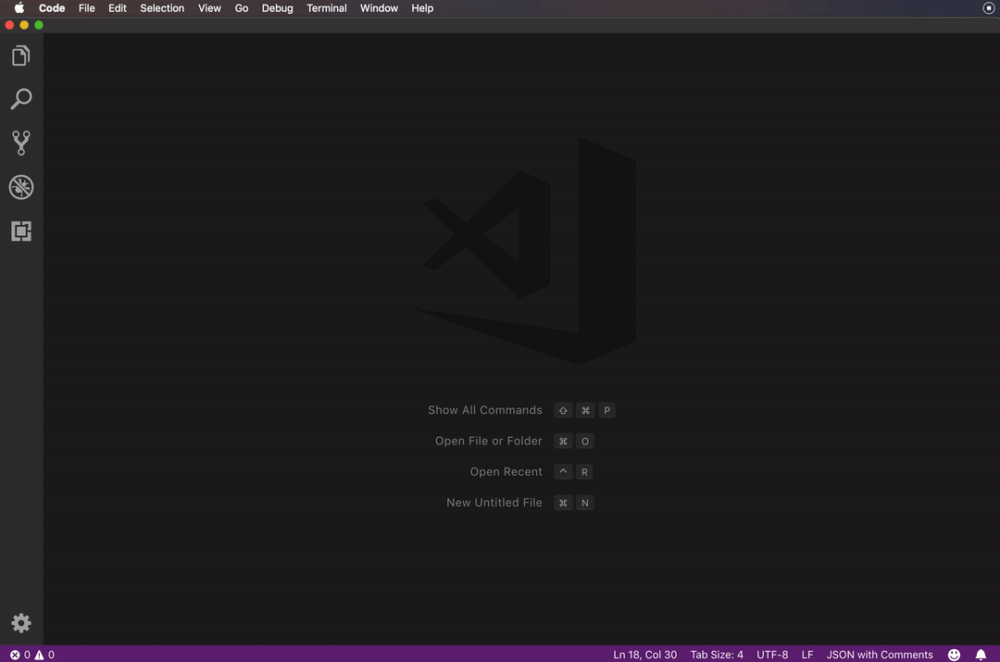
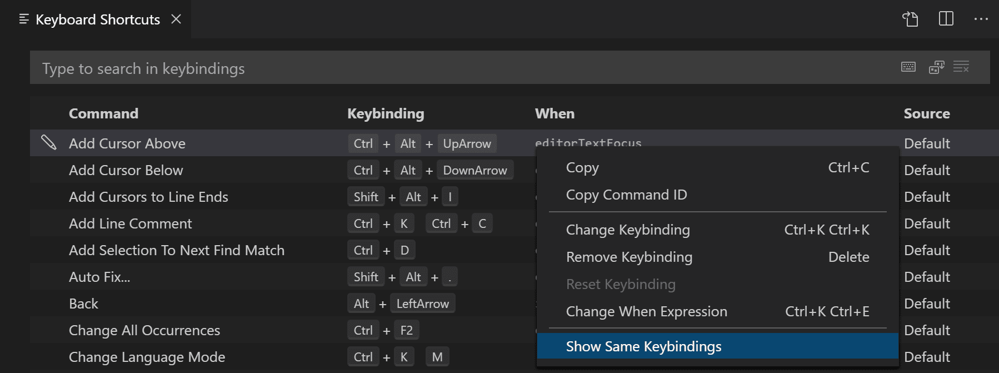

# 快捷键
Visual Studio Code 允许您直接从键盘执行大多数任务。此页面列出了默认绑定（键盘快捷键）并描述了如何更新它们。
## Keyboard Shortcuts editor
快捷键设置：
- Code > Preferences > Keyboard Shortcuts
- 快捷键 `⌘k ⌘s`

## 键盘快捷键参考
[macOS](chrome-extension://ikhdkkncnoglghljlkmcimlnlhkeamad/pdf-viewer/web/viewer.html?file=https%3A%2F%2Fcode.visualstudio.com%2Fshortcuts%2Fkeyboard-shortcuts-macos.pdf)
## Keymap extensions
键盘快捷键对生产力至关重要，改变键盘习惯可能很困难。为了帮助解决这个问题，File > Preferences > Keymaps 显示了一个流行的 keymap 扩展列表。这些扩展修改了 VS Code 快捷键以匹配其他编辑器的快捷键，因此您无需学习新的键盘快捷键。 Marketplace 中还有一个 Keymaps 类别的扩展。

## 编辑快捷键
省略。。。