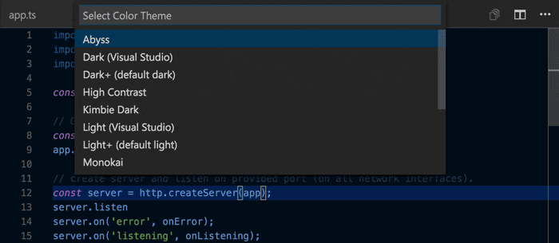

# 主题
## 颜色主题
颜色主题让您可以修改 Visual Studio Code 用户界面中的颜色以适应您的偏好和工作环境。
## 选择颜色主题
1. 在 VS Code 中，使用文件 > 首选项 > 颜色主题打开颜色主题选择器。 （macOS 上的代码 > 首选项 > 颜色主题）。
1. 您还可以使用键盘快捷键 `⌘K ⌘T` 来显示选择器。
1. 使用光标键预览主题的颜色。
1. 选择所需的主题，然后按 Enter。

## 来自市场的颜色主题
VS Code 中有几个开箱即用的颜色主题供您尝试。

社区已将更多主题上传到 VS Code 扩展市场。如果你找到了你想要使用的，安装它并重新启动 VS Code，新的主题将可用。

您可以使用 @category:"themes" 过滤器在扩展视图 (`⇧⌘X`) 搜索框中搜索主题。

## 自定义主题颜色
### 工作台颜色 Workbench colors
要设置 VS Code UI 元素的颜色，例如列表和树（文件资源管理器、建议小部件）、差异编辑器、活动栏、通知、滚动条、拆分视图、按钮等，请使用 workbench.colorCustomizations。

### 编辑器语法高亮
要调整编辑器的语法高亮颜色，请在用户设置 settings.json 文件中使用 editor.tokenColorCustomizations

## 删除默认颜色主题

您可以像使用任何其他 VS Code 扩展一样使用齿轮上下文菜单上的禁用命令禁用内置主题扩展。

## 文件图标主题

1. 在 VS Code 中，使用 File > Preferences > File Icon Theme 打开文件图标主题选择器。 （macOS 上的code > 首选项 > 文件图标主题）。
2. 您还可以使用命令面板中的首选项：文件图标主题命令 (`⇧⌘P`)。
3. 使用光标键预览主题的图标。
4. 选择您想要的主题，然后按 Enter。

