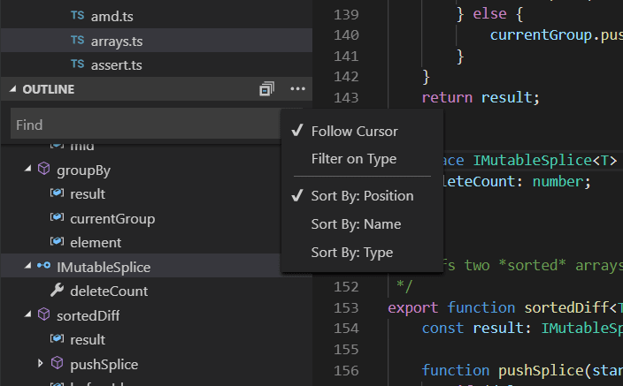
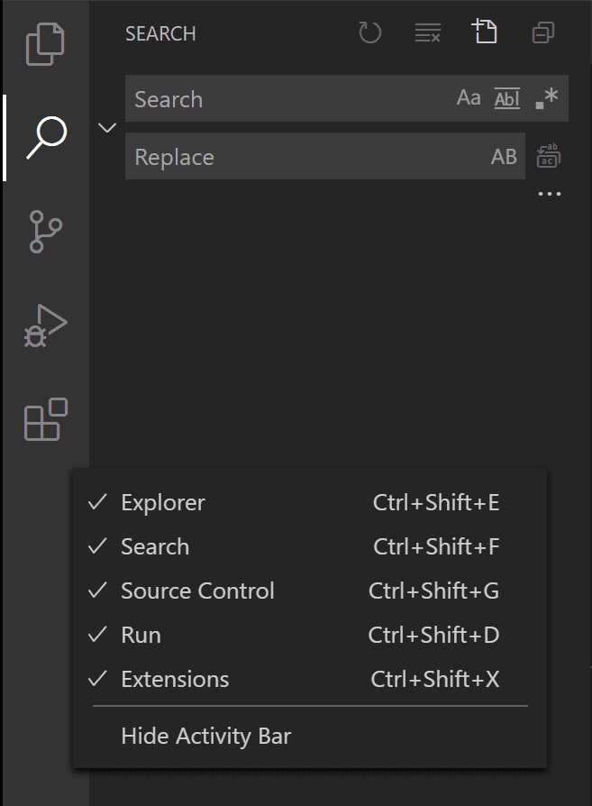
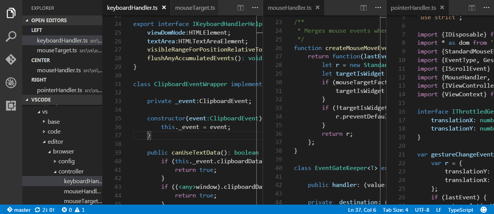
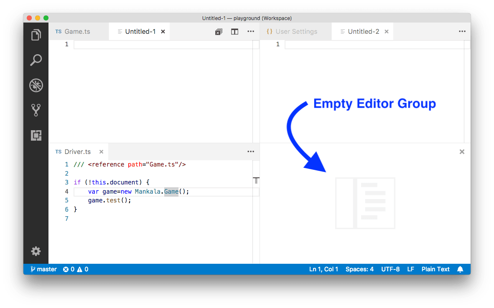

# 用户界面

## 基本布局
VS Code 具有简单直观的布局，可最大限度地为编辑器提供空间，同时留出足够的空间来浏览和访问文件夹或项目的完整上下文。用户界面分为五个区域：
- 编辑器 - 编辑文件的主要区域。您可以垂直和水平并排打开任意数量的编辑器。
- 侧栏 - 包含不同的视图，例如资源管理器，可在您处理项目时为您提供帮助。
- 状态栏 - 有关已打开项目和您编辑的文件的信息。
- 活动栏 - 位于最左侧，可让您在视图之间切换，并为您提供额外的特定于上下文的指标，例如启用 Git 时传出更改的数量。
- 面板 - 您可以在编辑器区域下方显示不同的面板，用于输出或调试信息、错误和警告或集成终端。面板也可以向右移动以获得更多垂直空间。
## 并排编辑
您可以垂直和水平并排打开任意数量的编辑器。如果您已经打开了一个编辑器，有多种方法可以在现有编辑器旁边打开另一个编辑器：
- `Alt` 单击资源管理器中的文件。
- `⌘\` 将活动编辑器一分为二。
- 从文件的资源管理器上下文菜单中打开到侧面 (⌃Enter)。
- 单击编辑器右上角的拆分编辑器按钮。
- 将文件拖放到编辑器区域的任意一侧。
- 快速打开 (`⌘P`) 文件列表中的 Ctrl+Enter（macOS：`Cmd+Enter`）。

默认情况下，编辑器将在活动编辑器的右侧打开。您可以通过设置 `workbench.editor.openSideBySideDirection` 来更改此行为，并配置为将新编辑器打开到活动编辑器的底部。
当您打开多个编辑器时，您可以通过按住 `Cmd` 键并按 1、2 或 3 在它们之间快速切换。
> 提示：您可以调整编辑器的大小并重新排序。拖放编辑器标题区域以重新定位或调整编辑器大小。
## Minimap
您可以单击或拖动阴影区域以快速跳转到文件的不同部分。

上图还显示了缩进指南（垂直线），可帮助您快速查看匹配的缩进级别。如果您想禁用缩进指南，您可以在您的用户或工作区设置中设置 "editor.guides.indentation": false。
## 面包屑

## 资源管理器
Explorer 用于浏览、打开和管理项目中的所有文件和文件夹。 VS Code 是基于文件和文件夹的——你可以通过在 VS Code 中打开文件或文件夹立即开始。

默认情况下，VS Code 会从资源管理器中排除一些文件夹（例如 .git）。使用 files.exclude 设置来配置从资源管理器中隐藏文件和文件夹的规则。
> 提示：您可以从 VS Code 外部将文件拖放到资源管理器中以复制它们（如果资源管理器为空，VS Code 将打开它们）
> 提示：键入`⌘P`（快速打开）以通过文件名快速搜索和打开文件。

- 右键单文件夹并,选择在命令提示符中打开可以与集成终端配合

- 右键单击文件或文件夹并选择在资源管理器中显示（或在 macOS 上在 Finder 中显示）导航到本机资源管理器中文件或文件夹的位置。
### 多选
使用 `Ctrl/Cmd` 键单击以选择单个文件，并使用 `Shift` + 单击以选择一个范围。
### 过滤

### 大纲

## 打开的编辑器
Explorer 的顶部是一个标记为 `OPEN EDITORS` 的视图。这是活动文件或预览的列表。这些是您之前在 VS Code 中打开的文件，您正在处理这些文件。

## 视图
文件资源管理器只是 VS Code 中可用的视图之一。也有视图：
- 搜索 - 在您打开的文件夹中提供全局搜索和替换。
- 源代码控制 - VS Code 默认包含 Git 源代码控制。
- 运行 - VS Code 的运行和调试视图显示变量、调用堆栈和断点。
- Extensions - 在 VS Code 中安装和管理你的扩展。
- 自定义视图 - 扩展贡献的视图。

提示：您可以使用视图：打开视图命令打开任何视图。

您可以在主视图中显示或隐藏视图，也可以通过拖放重新排列它们。

### Activity Bar
左侧的活动栏可让您在视图之间快速切换。您还可以通过将视图拖放到活动栏上来重新排序视图或完全删除视图（右键单击从活动栏中隐藏）。

## 命令面板
`⇧⌘P`打开  **Command Palette**
从这里，您可以访问 VS Code 的所有功能，包括用于最常见操作的键盘快捷键。

命令面板提供对许多命令的访问。您可以使用同一个交互式窗口执行编辑器命令、打开文件、搜索符号以及查看文件的快速大纲。这里有一些提示：
- `⌘P` 可让您通过键入名称导航到任何文件或符号
- `⌃Tab` 将循环浏览最后一组打开的文件
- `⇧⌘P` 将直接带您进入编辑器命令
- `⇧⌘O` 将让您导航到文件中的特定符号
- `⌃G` 将让您导航到文件中的特定行
  
类型 ？进入输入字段以获取您可以从此处执行的可用命令列表：

## setting

快捷键： `⌘,` 或 `Code > Preferences > Settings.`
要编辑工作区设置，请选择 WORKSPACE SETTINGS 选项卡以编辑工作区 settings.json 文件。
注意：工作区设置将覆盖用户设置，对于在团队中共享项目特定设置很有用。

## 禅模式
ZEN模式使您可以通过隐藏除编辑器（无活动条，状态栏，侧栏和面板）除外的所有UI来关注代码，从而全屏并居中编辑器布局。
Zen 模式可以使用 View 菜单、`Command Palette` 或快捷键 `⌘K Z` 切换。Double Esc 退出 Zen 模式。
## Tabs
Visual Studio Code 在编辑器上方的标题区域中显示带有选项卡（选项卡式标题）的打开项目。
打开文件时，会为该文件添加一个新选项卡。

## 预览模式
在资源管理器中单击或选择文件时，它会以预览模式显示并重用现有选项卡。如果您正在快速浏览文件并且不希望每个访问的文件都有自己的选项卡，这很有用。当您开始编辑文件或使用双击从资源管理器中打开文件时，一个新的选项卡专用于该文件。
预览模式在 Tab 标题中用斜体表示：

## 编辑组(Editor Groups)
当您拆分编辑器（使用拆分编辑器或打开到侧面命令）时，会创建一个新的编辑器区域，该区域可以容纳一组项目。您可以垂直和水平并排打开任意数量的编辑器区域。

## 网格编辑器布局
默认情况下，编辑器组以垂直列布局（例如，当您拆分编辑器以将其打开到一侧时）。您可以在任何您喜欢的布局中轻松排列编辑器组，无论是垂直还是水平：

在新的 View > Editor Layout 菜单中有一组预定义的编辑器布局：

在编辑器和编辑器组之间快速导航的的快捷键：
- `⌥⌘→` 转到正确的编辑器。
- `⌥⌘←`转到左侧编辑器。
- `⌃Tab` 打开编辑器组 MRU 列表中的上一个编辑器。
- `⌘1 `转到最左边的编辑器组。
- `⌘2 `进入中心编辑组。
- `⌘3 `转到最右边的编辑组。
- `⌘W `关闭活动编辑器。
- `⌘K W` 关闭编辑器组中的所有编辑器。
- `⌘K ⌘W` 关闭所有编辑器。
